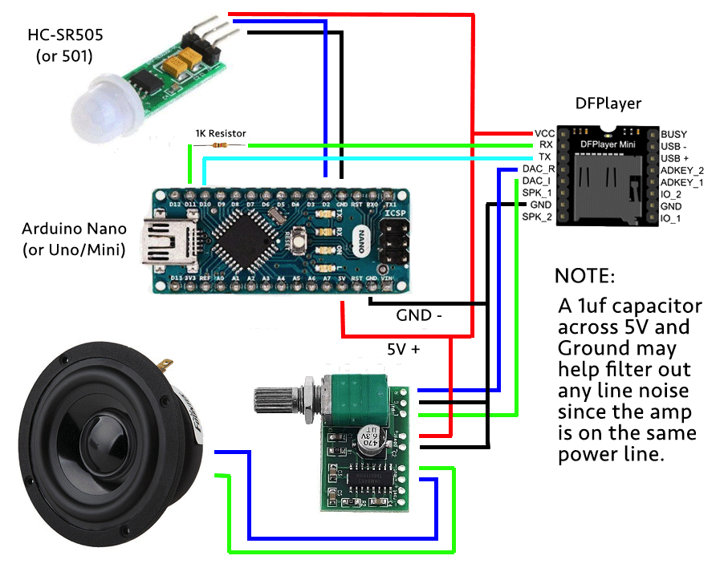
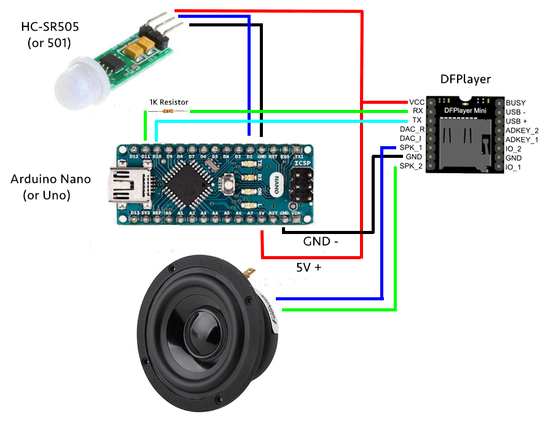

# Motion Activated Sound Player
This simple project builds a motion activated sound player.  Each time motion is sensed, an MP3 file is played.  I built this originally to play a random sound for my B1 Battle Droid (from the awesome Sean Fields at [Project842](https://www.etsy.com/shop/Project842)...look him up on [Facebook](https://www.facebook.com/Project842/)!), but it can be used in pretty much any project that requires motion detection.

The following components are needed (links are my Amazon affiliate links ;) ):

* Arduino [Uno](https://www.amazon.com/gp/product/B01EWOE0UU/ref=as_li_tl?ie=UTF8&camp=1789&creative=9325&creativeASIN=B01EWOE0UU&linkCode=as2&tag=becauseinterw-20&linkId=5a3ff39cbeda2af36acdc02d5aac1787), [Nano](https://www.amazon.com/gp/product/B07D5B3ZGX?ie=UTF8&tag=becauseinterw-20&camp=1789&linkCode=xm2&creativeASIN=B07D5B3ZGX) or [Mini](https://www.amazon.com/gp/product/B00E87VWQW/ref=as_li_tl?ie=UTF8&camp=1789&creative=9325&creativeASIN=B00E87VWQW&linkCode=as2&tag=becauseinterw-20&linkId=3f4a0d20c0498778e8aceed71cba8aaf).
* PIR (Passive Infrared) sensor such as [HC-SR501](https://www.amazon.com/gp/product/B012ZZ4LPM/ref=as_li_tl?ie=UTF8&camp=1789&creative=9325&creativeASIN=B012ZZ4LPM&linkCode=as2&tag=becauseinterw-20&linkId=7f162de77ee86479375fec4c83243bf7) or [HC-SR505](https://www.amazon.com/gp/product/B07DW49X56?ie=UTF8&tag=becauseinterw-20&camp=1789&linkCode=xm2&creativeASIN=B07DW49X56)
* [DFPlayer Mini](https://www.amazon.com/gp/product/B01MQ0GFZV?ie=UTF8&tag=becauseinterw-20&camp=1789&linkCode=xm2&creativeASIN=B01MQ0GFZV) (for MP3) and [Micro SD card](https://www.amazon.com/gp/product/B010Q57SEE?ie=UTF8&tag=becauseinterw-20&camp=1789&linkCode=xm2&creativeASIN=B010Q57SEE)
* Amp board or circuit (such as a [PAM8403](https://www.amazon.com/gp/product/B01DKAI51M?ie=UTF8&tag=becauseinterw-20&camp=1789&linkCode=xm2&creativeASIN=B01DKAI51M)) - this is optional, but will give you much more volume.
* Speaker

The DFPlayer has a built-in amp, but in a crowded room it might not be loud enough. Fortunately, it also has two (2) DAC outputs that you can run to an amplifier.

## Setup
Follow the wiring diagram to build the sensing circuit. Then edit, compile and load the Arduino sketch. You'll need to install the [DFPlayer libary](https://github.com/DFRobot/DFRobotDFPlayerMini/archive/1.0.3.zip) in your Arduino IDE.

## Sketch Modifications
You'll need to edit a couple settings in the sketch to match your setup:

```byte maxRnd = 20;```

This is the maximum number of files your have loaded on your SD card.  For example, with this setting, your MP3 files should be named sequentially from 0001.mp3 to 0020.mp3.

```byte volume = 30;```

This is the volume for the DFPlayer.  It affects BOTH the speaker lines out AND the DAC lines.  You could also add a potentiometer and modify the sketch to read that and set the volume, but if you add an amplifier board with a volume control, just set this to 30 (max) and use the volume control on the amplifier.

## Adding the Sound Files
The DFPlayer is a great mult-purpose MP3 player and is easy to use, but it DOES have some quirks:
* Files must be named with leading zeros. *For example: 0001.mp3 or 0020.mp3*
* Despite the name of the file, DFPlayer will index the files according to the timestamp on the file, so you have to copy the files to the SD card in order from 0001 to ?? so that they are indexed the same as their file name.
* If you copy the files using a Mac, it will also copy some hidden files that you'll need to clean by running:

    ```dot_clean /Volumes/{name of your SD card}```

## Looping or Random
By default, the sketch uses the ```maxRnd``` variable to calculate a range (from 1 to maxRnd) and plays a random sound each time the sensor is triggered, being careful not to play the last sound again.

Alternatively, you can comment out this portion of the code and uncomment the line:

```DFPlayer.next();```

to just keep looping through the sounds in order each time the sensor is triggered.

## Notes on the PIR
Depending upon the sensor you use, some things to keep in mind:
* For the smaller HC-SR505 sensor, you have a much smaller sensor area, but a shorter warmup time.
* For the larger HC-SR501, you have a much larger sensor area and a longer warmup time (1 to 3 minutes depending on the brand, etc.) and can adjust both the sensitivity and the delay time until the sensor resets.  You should keep the jumper set to single trigger.

For both sensors, once it is triggered, it will report that it's being triggered for several seconds, then go into a standby mode, then reset after a set number of seconds.

The sketch takes this into account so that only the very first report of a trigger is used to kick off the sound play, and then once the sound is finished, a flag is reset to let the the sketch know it's ready to play another file when the sensor is tripped.  If the sensor is tripped or is still reporting being tripped while a sound is playing, it will be ignored. This stops a bunch of sounds from being played at once due to the repeated reports of the sensor being triggered.


## Circuit
Below is a diagram of the circuit wiring.  I would suggest putting all of this on a [prototyping board](https://www.amazon.com/gp/product/B01M7R5YIB/ref=as_li_tl?ie=UTF8&camp=1789&creative=9325&creativeASIN=B01M7R5YIB&linkCode=as2&tag=becauseinterw-20&linkId=a01be9c183a31806452841fcad9ce93a) to make it easier to install in your setup.



Alternate diagram if no external amplifier is used:


